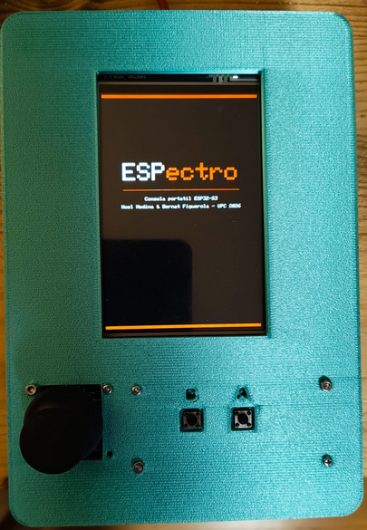
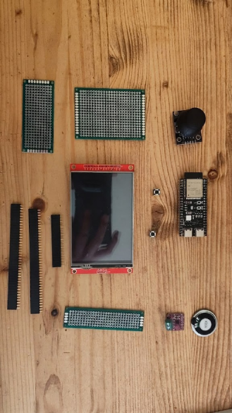

# ESPectro 🎮
<p align="center">
  
  
</p>

**Consola portátil de videojuegos basada en ESP32-S3**, desarrollada como proyecto final de la asignatura de Processadors Digitals (UPC, 2026).

> Noel Medina & Bernat Figuerola — ESUPC

---

## ¿Qué es ESPectro?

ESPectro es una consola portátil de videojuegos diseñada y construida desde cero. Combina hardware personalizado, firmware en C++ con FreeRTOS, conectividad WiFi, un dashboard web en tiempo real e integración con modelos de lenguaje (LLMs) mediante el protocolo MCP.

El sistema permite cargar nuevos juegos sin cables — directamente desde el navegador vía WiFi.

---

## Hardware

| Componente | Modelo |
|------------|--------|
| Procesador | ESP32-S3-DevKitC-1 N16R8 |
| Pantalla | TFT ILI9488 4" (SPI) |
| Joystick | HW-504 analógico |
| Audio | MAX98357A I2S + altavoz 8Ω |
| Botones | 2× táctil 6×6mm |
| Carcasa | PLA impreso en 3D — diseño propio |

### Pines de conexión

| GPIO | Función |
|------|---------|
| 38 | SPI MOSI (pantalla) |
| 47 | SPI SCLK (pantalla) |
| 48 | SPI MISO (pantalla) |
| 2 | TFT DC |
| 1 | TFT CS |
| 0 | TFT RST |
| 39 | TFT BL |
| 5 | Joystick VRX |
| 4 | Joystick VRY |
| 42 | Joystick SW |
| 40 | Botón A |
| 41 | Botón B |
| 8 | I2S BCLK |
| 16 | I2S LRCLK |
| 18 | I2S DIN |

---

## Arquitectura del software

```
Arranca
  → Splash screen ESPectro
  → Menú principal
        ├─ Botón A → Juego
        └─ Botón B → Game Loader (WiFi)
```

### FreeRTOS — 3 tareas concurrentes

| Tarea | Core | Prioridad | Función |
|-------|------|-----------|---------|
| `musicTask` | 0 | 2 | Audio I2S continuo |
| `wifiTask` | 0 | 1 | Servidor web en segundo plano |
| `loop()` | 1 | — | Juego, menú, lógica |

**Sincronización:**
- `audioQueue` — Queue FreeRTOS para efectos de sonido
- `recordMutex` — Mutex para proteger acceso a NVS entre tareas

### WiFi y dashboard

El WiFi arranca automáticamente al encender la consola y se mantiene activo en segundo plano mientras se juega.

- **Red:** `ESPectro` · **Contraseña:** `gameloader`
- **Dashboard:** `http://192.168.4.1`

El dashboard muestra en tiempo real por cada juego:
- Récord máximo
- Número de partidas jugadas
- Media de puntuación
- Gráfica de barras de las últimas 10 partidas

### NVS — Persistencia

Los récords se guardan en la memoria flash no volátil (NVS) y persisten entre reinicios y entre juegos. El historial guarda las últimas 20 partidas por juego.

### Game Loader — OTA vía WiFi

Permite actualizar o cambiar el juego sin cables:

1. Pulsa **Botón B** en el menú
2. Conéctate a la red **ESPectro**
3. Abre `http://192.168.4.1` en el navegador
4. Selecciona el `.bin` y súbelo
5. La consola reinicia con el nuevo juego

### MCP — Integración con LLMs

La consola expone un servidor MCP que permite a los modelos de lenguaje consultar los datos en tiempo real.

| Endpoint | Descripción |
|----------|------------|
| `GET /mcp/tools` | Lista las tools disponibles |
| `GET /mcp/tools/call?tool=get_records` | Récords e historial |
| `GET /mcp/tools/call?tool=get_status` | Uptime y memoria |
| `GET /mcp/tools/call?tool=get_system_info` | Info del hardware |

---

## Juegos disponibles

| Juego | Repositorio | Descripción |
|-------|------------|-------------|
| 🏎 Road Rush | [road_rush_espectro](https://github.com/bf-upc/road_rush_espectro) | Juego de carreras — esquiva obstáculos y acelera con el joystick |
| 🟦 Tetris | [tetris_espectro](https://github.com/bf-upc/tetris_espectro) | Tetris clásico — piezas, líneas y puntuación |
| ♣️ Blackjack | [blackjack_espectro](https://github.com/bf-upc/blackjack_espectro) | Blackjack con baraja de poker y mecánica de apuestas |

---

## Estructura del repositorio

```
base_espectro/
├── README.md
├── PLANTILLA_JUEGOS/
│   ├── src/
│   │   └── main.cpp        ← PLANTILLA_JUEGOS para nuevos juegos
│   ├── platformio.ini
│   └── README.md           ← documentación para desarrolladores
├── mcp/
│   ├── mcp_ollama.py     ← puente Ollama ↔ ESPectro
│   ├── start_mcp_bridge.sh  ← script linux
│   └── requirements.txt
├── 3D/
│   ├── front.stl         ← carcasa frontal (impresión 3D)
│   └── back.stl            ← carcasa trasera (impresión 3D)
└── docs/
    ├── memoria_tecnica.pdf
    ├── esquema_electrico.pdf
    └── img/
```

---

## Carcasa 3D

El diseño de la carcasa está disponible en la carpeta [`3D/`](3D/) en formato STL, listo para imprimir.

| Archivo | Descripción |
|---------|------------|
| `front.stl` | Parte frontal — pantalla, joystick y botones |
| `back.stl` | Parte trasera — ESP32 y altavoz |

**Parámetros de impresión recomendados:**
- Material: PLA
- Relleno: 20%
- Soportes: No necesarios
- Tornillería: M2×25 (unión frontal/trasera), M3×6 (pantalla), M2×6 (joystick)

---

## Crear un nuevo juego

Consulta [`PLANTILLA_JUEGOS/README.md`](PLANTILLA_JUEGOS/README.md) para las instrucciones completas.

Resumen:
1. Copia `PLANTILLA_JUEGOS/src/main.cpp` a tu proyecto
2. Rellena los 4 `TODO` (clave del récord, título, variables, lógica)
3. Compila con PlatformIO
4. Sube el `.bin` vía Game Loader

El juego aparece automáticamente en el dashboard sin ninguna configuración adicional.

---

## Usar el MCP con Ollama

```bash
# Instalar dependencias
pip install -r mcp/requirements.txt
# Instalar modelo necesario
ollama pull llama3.2:3b
# Parar Ollama y reiniciar forzando CPU
pkill ollama
CUDA_VISIBLE_DEVICES="" ollama serve &
sleep 3

# Ejecutar el puente
python3 mcp/espectro_mcp.py
```

Ejemplos de preguntas:
- *"¿Cuál es el récord del Road Rush?"*
- *"¿Cuántas partidas se han jugado en total?"*
- *"¿Cuánto tiempo lleva encendida la consola?"*

---

## Compilar y flashear

Requisitos: **PlatformIO** y la librería `lovyan03/LovyanGFX @ ^1.1.12`.

```bash
# Clonar un juego
git clone https://github.com/bf-upc/road_rush_espectro
cd road_rush_espectro

# Compilar y flashear
pio run --target upload

# Monitor serie
pio device monitor
```

---

## Buses y periféricos

| Bus | Periférico | Función |
|-----|-----------|---------|
| SPI | ILI9488 | Pantalla TFT |
| I2S | MAX98357A | Audio digital |
| ADC | HW-504 | Joystick analógico |

---
